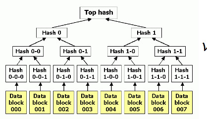
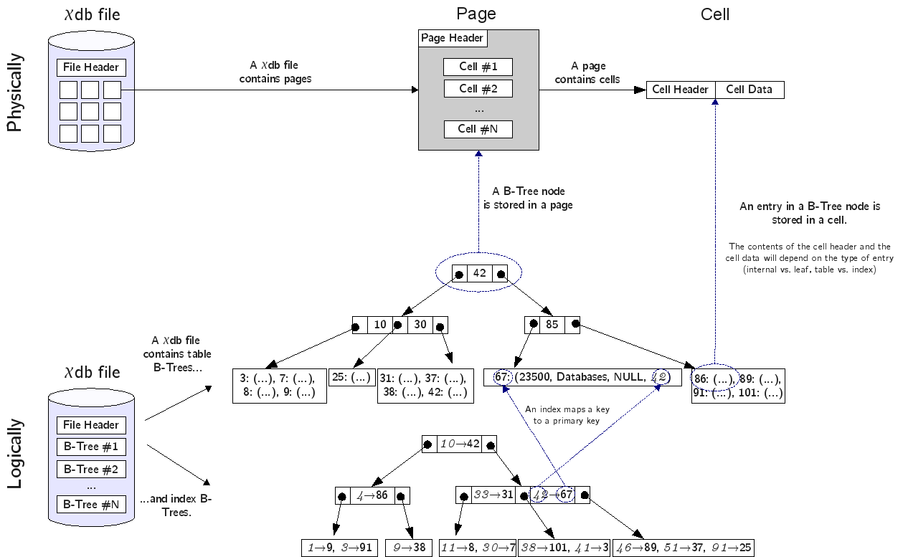
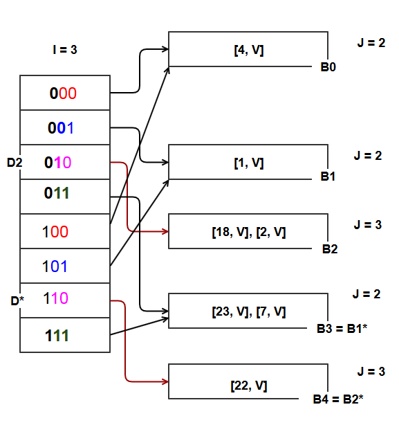

# Proyecto 1 - Base de Datos 2 (CS2042)

## Tabla de Contenidos

- [Proyecto 1 - Base de Datos 2 (CS2042)](#proyecto-1---base-de-datos-2-cs2042)
  - [Tabla de Contenidos](#tabla-de-contenidos)
  - [Resumen](#resumen)
  - [Introducción](#introducción)
    - [Objetivos del proyecto](#objetivos-del-proyecto)
    - [Descripción del dominio de datos](#descripción-del-dominio-de-datos)
    - [Resultados esperados con indexación](#resultados-esperados-con-indexación)
  - [Técnicas utilizadas](#técnicas-utilizadas)
    - [Técnicas de indexación de archivos utilizadas](#técnicas-de-indexación-de-archivos-utilizadas)
  - [Implementación del Parser SQL](#implementación-del-parser-sql)
    - [¿Por qué usar Expresiones Regulares?](#¿por-qué-usar-expresiones-regulares?)
    - [Ejemplos de Secuencias SQL](#ejemplos-de-secuencias-sql)
    - [Justificación de uso](#justificación-de-uso)
  - [Autores](#autores)
  - [Referencias](#referencias)

## Resumen
El presente proyecto consta en la implementación de un sistema de gestión de base de datos utilizando 3 técnicas de organización de archivos en memoria secundaria: AVL File, B+ Tree y Extendible Hash, todos escritos en C++. Además, se implementó un parser de SQL para la ejecución de consultas. Asimismo, se creó una API en C++ y una UI en Nextjs para consumir la API, ambos deployeados en la nube.

## Introducción
En el ámbito de las bases de datos, las técnicas de organización de archivos desempeñan un papel crucial en la optimización del rendimiento y la gestión eficiente de la memoria secundaria. Estas estructuras de datos están diseñadas para almacenar y recuperar grandes volúmenes de información de manera rápida y eficiente, mejorando significativamente la velocidad de consulta y la capacidad de escalabilidad del sistema. Además, permiten una mejor utilización de los recursos físicos y una gestión más efectiva del espacio en disco.

### Objetivos del proyecto
+ Implementar 3 técnicas de organización de archivos en memoria secundaria: AVL File, B+ Tree y Extendible Hash.
+ Desarrollar un parser de SQL para la ejecución de consultas.
+ Implementar una interfaz gráfica funcional con herramientas de frontend, backend y cloud computing.
+ Realizar un análisis comparativo de las técnicas de organización de archivos implementadas.
### Descripción del dominio de datos

El dominio de datos utilizado en este proyecto corresponde a un conjunto de registros de aplicaciones móviles de la App Store. Cada registro contiene información detallada sobre una aplicación, incluyendo su nombre, categoría, precio, calificación, entre otros. Para este proyecto, se considera una base de datos de aplicaciones móviles con los siguientes campos:

- `id`: Identificador único de la aplicación.
- `track_name`: Nombre de la aplicación.
- `size_bytes`: Tamaño en bytes de la aplicación.
- `currency`: Moneda utilizada para el precio.
- `price`: Precio de la aplicación.
- `rating_count_tot`: Número total de calificaciones.
- `rating_count_ver`: Número de calificaciones de la versión actual.
- `user_rating`: Calificación promedio de los usuarios.
- `user_rating_ver`: Calificación promedio de la versión actual.
- `ver`: Versión de la aplicación.
- `cont_rating`: Clasificación por contenido.
- `prime_genre`: Género principal de la aplicación.
- `sup_devices.num`: Número de dispositivos compatibles.
- `ipadSc_urls.num`: Número de capturas de pantalla para visualización.
- `lang.num`: Número de idiomas soportados.
- `vpp_lic`: Licencia VPP.

### Resultados esperados con indexación

La implementación de las técnicas de organización de archivos en memoria secundaria permitirá mejorar la eficiencia y el rendimiento de las consultas SQL en la base de datos de aplicaciones móviles. Al utilizar índices y estructuras de datos optimizadas, se espera reducir el tiempo de acceso a los registros, mejorar la velocidad de búsqueda y recuperación de información, y optimizar el uso de la memoria secundaria. Además, se espera que la implementación de un parser SQL permita ejecutar consultas de manera eficiente y precisa, facilitando la interacción con la base de datos y mejorando la experiencia del usuario.

## Técnicas utilizadas

Para este proyecto, se implementaron las siguientes técnicas de organización de archivos en memoria secundaria:

- AVL File
- B+ Tree File
- Extendible Hash File

Estas técnicas se utilizaron para organizar y gestionar la información de la base de datos de aplicaciones móviles, permitiendo una búsqueda eficiente y una recuperación rápida de los registros. Cada técnica de organización de archivos tiene sus propias características y ventajas, que se detallan a continuación:

### Técnicas de indexación de archivos utilizadas

#### AVL File

El AVL File es una estructura de árbol binario balanceado que permite realizar búsquedas, inserciones y eliminaciones en tiempo logarítmico. Esta técnica de indexación es eficiente para la búsqueda de registros en la base de datos y garantiza un tiempo de acceso óptimo a los datos.

**Ilustración de un Árbol AVL**


Al igual que en un árbol AVL, en un AVL File se garantiza que la diferencia de alturas entre los subárboles izquierdo y derecho de cada nodo sea como máximo 1. Esto permite mantener el árbol balanceado y garantizar un tiempo de acceso logarítmico a los datos.

**Ilustración de un AVL File**



- Inserción: Permite agregar un nuevo registro al árbol AVL. Para insertar, se realiza una búsqueda en el árbol para encontrar la posición adecuada y se ajustan las alturas de los nodos para mantener el equilibrio del árbol. Luego, se realiza una rotación simple o doble según sea necesario para equilibrar el árbol. La complejidad de la inserción es O(log n).
- Eliminación: Permite eliminar un registro del árbol AVL. Para eliminar, se realiza una búsqueda en el árbol para encontrar el nodo a eliminar y se ajustan las alturas de los nodos para mantener el equilibrio del árbol. Luego, se realiza una rotación simple o doble según sea necesario para equilibrar el árbol. La complejidad de la eliminación es O(log n).
- Búsqueda: Permite buscar un registro en el árbol AVL por clave. La búsqueda se realiza de manera recursiva, comparando la clave con la raíz del árbol y dirigiéndose al subárbol izquierdo o derecho según sea necesario. La complejidad de la búsqueda es O(log n).

#### B+ Tree File

El B+ Tree File es una estructura de árbol balanceado que se utiliza comúnmente en bases de datos para organizar y gestionar grandes volúmenes de información. Esta técnica de indexación es eficiente para la búsqueda secuencial y la recuperación de registros en la base de datos.

**Ilustración de un Árbol B+**


Al igual que en un árbol B+, en un B+ Tree File se garantiza que cada nodo interno tenga al menos la mitad de sus hijos ocupados. Esto permite mantener el árbol balanceado y garantizar un tiempo de acceso logarítmico a los datos.

**Ilustración de un B+ Tree File**



- Inserción: Permite agregar un nuevo registro al árbol B+. Para insertar, se realiza una búsqueda en el árbol para encontrar la posición adecuada y se ajustan los punteros de los nodos para mantener el equilibrio del árbol. Luego, se realiza una división de nodos según sea necesario para equilibrar el árbol. La complejidad de la inserción es O(log n).
- Eliminación: Permite eliminar un registro del árbol B+. Para eliminar, se realiza una búsqueda en el árbol para encontrar el nodo a eliminar y se ajustan los punteros de los nodos para mantener el equilibrio del árbol. Luego, se realiza una fusión de nodos según sea necesario para equilibrar el árbol. La complejidad de la eliminación es O(log n).
- Búsqueda: Permite buscar un registro en el árbol B+ por clave. La búsqueda se realiza de manera secuencial, siguiendo los punteros de los nodos internos y hojas hasta encontrar el registro deseado. La complejidad de la búsqueda es O(log n).
- Búsqueda Rango: Permite buscar un rango de registros en el árbol B+ por clave. La búsqueda se realiza de manera secuencial, siguiendo los punteros de los nodos internos y hojas hasta encontrar los registros dentro del rango especificado. La complejidad de la búsqueda rango es O(log n).

#### Extendible Hash File

El Extendible Hash File es una técnica de indexación que utiliza una función hash para organizar y gestionar los registros de la base de datos. Esta técnica es eficiente para la búsqueda de registros por clave y garantiza un tiempo de acceso constante a los datos.

**Ilustración de una Tabla Hash Extendible**



En un Extendible Hash File, se utiliza una función hash para asignar cada registro a un cubo de dispersión. Cada cubo contiene un número fijo de registros y se puede dividir en dos cubos si se alcanza la capacidad máxima. Esto permite una búsqueda eficiente de registros por clave y garantiza un tiempo de acceso constante a los datos.

La implementación de un Extendible Hash File consta de los siguientes componentes:

- Directorio: Estructura de datos que contiene los punteros a los cubos de dispersión.
- Cubo de Dispersión: Estructura de datos que contiene los registros y punteros a los registros.

Las operaciones básicas en un Extendible Hash File son las siguientes:

- Inserción: Permite agregar un nuevo registro al cubo de dispersión correspondiente. Si el cubo alcanza su capacidad máxima, se divide en dos cubos y se actualiza el directorio. La complejidad de la inserción es O(1).
- Eliminación: Permite eliminar un registro del cubo de dispersión correspondiente. Si el cubo queda vacío, se fusiona con otro cubo y se actualiza el directorio. La complejidad de la eliminación es O(1).
- Búsqueda: Permite buscar un registro en el cubo de dispersión correspondiente por clave. La búsqueda se realiza de manera directa, utilizando la función hash para encontrar el cubo y el registro deseado. La complejidad de la búsqueda es O(1).

A diferencia del resto de estructuras, aquí no se puede realizar una búsqueda rango, ya que no se puede recorrer los cubos de dispersión de manera secuencial y ordenada.


## Implementación del Parser SQL

La implementación de un parser SQL en C++ utilizando expresiones regulares completas es una estrategia eficiente y efectiva para analizar y procesar consultas SQL. Las expresiones regulares, también conocidas como regex, son una poderosa herramienta para el manejo de cadenas de texto que permiten buscar, encontrar, y manipular texto de manera flexible y eficiente.

### ¿Por qué usar Expresiones Regulares?

Las expresiones regulares ofrecen una gran flexibilidad y precisión al momento de reconocer patrones en las cadenas de texto. En el caso de un parser SQL, las expresiones regulares permiten identificar de manera precisa los diferentes componentes de una consulta SQL, como los comandos `CREATE`, `SELECT`, `INSERT`, `DELETE`, entre otros, así como los parámetros y argumentos asociados a estos comandos.

Por ejemplo, podemos considerar la siguiente secuencia SQL:

```sql
CREATE TABLE apple_store FROM FILE “C:\appleStore.csv” USING AVL INDEX ("id")
```

Una expresión regular bien diseñada puede identificar de manera precisa el comando `CREATE TABLE`, el nombre de la tabla `apple_store`, la ruta del archivo `C:\appleStore.csv`, y el índice hash `id`.

### Ejemplos de Secuencias SQL

```sql
SELECT * FROM apple_store WHERE id = 342352359
SELECT * FROM apple_store WHERE id BETWEEN 30000000 AND 50000000
INSERT INTO apple_store VALUES (30000000, "YAPE", 1000000, "USD", 0.0, 1000000, 1000000, 5.0, 5.0, "1.0", "4+", "Social Networking", 37, 5, 1, 1)
DELETE FROM apple_store WHERE id = 342352359
```

### Justificación de uso

El uso de expresiones regulares en la implementación de un parser SQL es una práctica común en la industria del software debido a su eficiencia y precisión. Según Nievergelt (2015), las expresiones regulares son una herramienta fundamental en el análisis de texto y se utilizan ampliamente en la implementación de compiladores e intérpretes, incluyendo los parsers SQL.

## Análisis comparativo

[//]: # (Gráficas, considerar dos métricas: total de accesos a disco duro {read & write} y tiempo de ejecución en milisegundos) 

### Inserción
### Búsqueda
### Eliminación

### Resultados experimentales

[//]: # (Discusión de los resultados experimentales )

## Pruebas de uso y presentación
### Interfaz gráfica


[//]: # (Link al frontend en la nube)
[//]: # ([Google]&#40;https://www.google.com&#41;)

### Demostración de funcionalidades

[//]: # (Link de youtube a la grabación )
[//]: # ([Google]&#40;https://www.google.com&#41;)

## Autores

| **Benjamin Soto** | **Edgar Chambilla** | **Fabrizzio Vilchez** | **Ian Gonzales** | **Jeffrey Monja** |
|:------------:|:------------:|:------------:|:------------:|:------------:|
|  |  |  |  |  |
| [https://github.com/SotoBenjamin](https://github.com/SotoBenjamin) | [https://github.com/Edgar5377](https://github.com/Edgar5377) | [https://github.com/Fabrizzio20k](https://github.com/Fabrizzio20k) | [https://github.com/mukanjy0](https://github.com/mukanjy0) | [https://github.com/jeffreymonjacastro](https://github.com/jeffreymonjacastro) |

## Referencias

- Nievergelt, Y. (2015). Logic, mathematics, and computer science: modern foundations with practical applications. Springer.